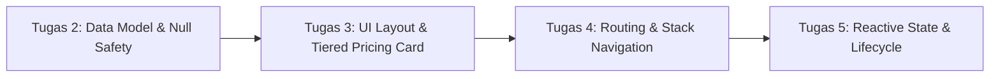

# Mobile-T3D: Aplikasi Katalog & Pemesanan Layanan IT (Flutter)

**Software Engineering Division — Mobile Developer**  
**Program Studi Teknologi Informasi — Kelas T3D**  
**Fakultas Ilmu Komputer, Universitas Brawijaya**

---

## 👤 Identitas Mahasiswa

| Field | Keterangan |
| :--- | :--- |
| **Nama Lengkap** | Diego Armando Ramadhan |
| **NIM** | 253140701111062 |
| **Kelas** | T3D |
| **Mata Kuliah** | Pemrograman Mobile |
| **Repositori GitHub** | [https://github.com/stanlevv/mobile-T3D](https://github.com/stanlevv/mobile-T3D) |

---

## 🚀 Ikhtisar Modul Praktikum (Tugas 2 s.d. 5)

Proyek ini mendemonstrasikan arsitektur aplikasi Flutter yang scalable, modular, dan reaktif melalui 4 tahapan praktikum:



1. **Tugas #2 (Model & Null Safety)**:
   * Perancangan data class dengan *Sound Null Safety* (`PackageModel`).
   * Serialisasi dan deserialisasi data manual (`fromJson` / `toJson`) dengan fallback nilai default (`??`).
2. **Tugas #3 (Widget & Layouting)**:
   * Merancang kartu harga bertingkat (`PricingCard`) yang *reusable*.
   * Kombinasi layout `Container`, `Column`, `Row` (*baseline alignment*), serta badge melayang menggunakan `Stack` + `Positioned`.
3. **Tugas #4 (Routing & Stack Navigation)**:
   * **Screen 1 (Katalog)**: `StatelessWidget` dengan `ListView.builder` merender daftar 3 paket layanan IT.
   * **Navigasi Tumpukan**: `Navigator.push` dengan `MaterialPageRoute` & pengiriman data model (*passing data*).
   * **Screen 2 (Detail)**: `StatefulWidget` dengan layout vertikal `Column` dan container pastel mint (`#E8F5E9`).
4. **Tugas #5 (Event, Reactive State & Lifecycle)**:
   * Pengelolaan state lokal reaktif menggunakan `setState()`.
   * Counter kuantitas pesanan, toggle switch support prioritas 24/7 (`+Rp 250.000`), kalkulasi total biaya real-time, bookmark, dan dialog konfirmasi pemesanan.

---

## 📁 Struktur Direktori Proyek

```text
mobile-T3D/
├── lib/
│   ├── models/
│   │   └── package_model.dart       # Model data & 3 dummy packages
│   ├── screens/
│   │   ├── catalog_screen.dart      # Screen 1: StatelessWidget (ListView 3 cards)
│   │   └── detail_screen.dart       # Screen 2: StatefulWidget (Column + Pastel box + setState)
│   ├── widgets/
│   │   └── pricing_card.dart        # Reusable card component (Tugas #3)
│   └── main.dart                    # Entry point aplikasi (Material 3 Theme)
├── pubspec.yaml                     # Konfigurasi dependensi Flutter
├── SUBMISSION_TUGAS_4.md            # Laporan teknis resmi Tugas #4
├── SUBMISSION_TUGAS_5.md            # Laporan teknis resmi Tugas #5
└── README.md                        # Dokumentasi utama repositori
```

---

## 📱 Panduan Menjalankan Aplikasi

### 1. Prasyarat
* **Flutter SDK**: Versi `>= 3.13.1`
* **Dart SDK**: Versi `^3.13.1`
* **Target Emulator**: Android / iOS / Chrome (Flutter Web)

### 2. Langkah Instalasi & Eksekusi
```bash
# 1. Unduh dependensi
flutter pub get

# 2. Jalankan aplikasi pada perangkat aktif / Google Chrome
flutter run -d chrome
```

---

## 📄 Laporan Praktikum
* 📑 [Laporan Tugas #4 (Routing & Navigation)](SUBMISSION_TUGAS_4.md)
* 📑 [Laporan Tugas #5 (Event & State Management)](SUBMISSION_TUGAS_5.md)
