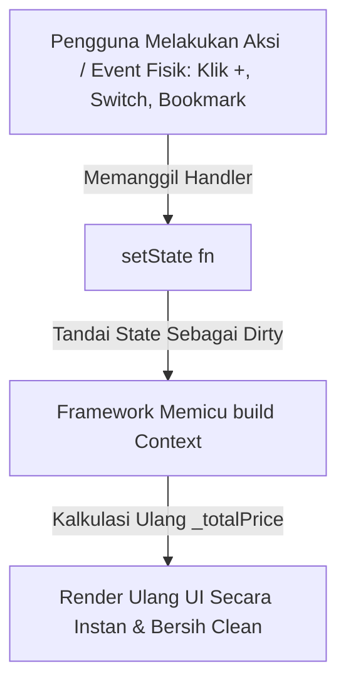

# Laporan Tugas Praktikum #5: Event, Reactive State & Widget Lifecycle

**Software Engineering Division — Mobile Developer**  
**Program Studi Teknologi Informasi — Kelas T3D**  
**Fakultas Ilmu Komputer, Universitas Brawijaya**

---

## 📋 1. Identitas Mahasiswa

| Field | Keterangan |
| :--- | :--- |
| **Nama Lengkap** | Diego Armando Ramadhan |
| **NIM** | 253140701111062 |
| **Kelas** | T3D |
| **Mata Kuliah** | Pemrograman Mobile (Mobile Developer) |
| **Topik Modul** | Tugas #5: Event, State Management Lokal & Widget Lifecycle |

---

## 🎯 2. Evaluasi Rubrik & Pemenuhan Scope of Work Tugas #5

| No | Requirement Scope of Work (Tugas #5) | Status | Bukti Implementasi pada Kode |
| :-: | :--- | :---: | :--- |
| **a** | **Screen 1 (Beranda / Katalog)** wajib `StatelessWidget` dengan `ListView` 3 cards dan tombol yang bisa diklik. | ✅ Terpenuhi | `lib/screens/catalog_screen.dart` mengimplementasikan `StatelessWidget` dengan `ListView.builder` merender 3 `PricingCard` (Paket Starter, Profesional, dan Enterprise). |
| **b** | **Navigasi Stack (`Navigator.push`)** untuk perpindahan Screen 1 ke Screen 2. | ✅ Terpenuhi | Tombol *"Pilih Paket"* memicu `Navigator.push` dengan `MaterialPageRoute` dan mengirimkan objek model (`package`) ke `DetailScreen`. |
| **c** | **Screen 2 (Detail Katalog)** wajib tata letak vertikal `Column` & `StatefulWidget`. | ✅ Terpenuhi | `lib/screens/detail_screen.dart` berupa `StatefulWidget` dengan layout vertikal `Column` dalam `SingleChildScrollView`. |
| **d** | **Elemen Visual Screen 2**: <br>• Icon back kembali ke Screen 1<br>• Text nama katalog & harga<br>• Container warna pastel & padding deskripsi | ✅ Terpenuhi | • `AppBar` otomatis memuat icon panah kembali (`Navigator.pop`).<br>• Text judul, subjudul, dan harga satuan.<br>• `Container` warna pastel hijau mint (`#E8F5E9` & border `#C8E6C9`) dengan padding `16dp`. |
| **e** | **Struktur Aplikasi**: `AppBar` agar fungsi tombol "Kembali" bawaan otomatis tersedia. | ✅ Terpenuhi | `AppBar(title: Text(package.title))` dengan default back button Material 3. |
| **f** | **Implementasi Konsep Event & State** | ✅ Terpenuhi | Mengimplementasikan 5 mekanisme interaktif: counter kuantitas (`+` / `-`), switch support prioritas (`+Rp 250.000`), kalkulasi total biaya real-time, bookmark toggle, dan dialog pesanan. |

---

## 📱 3. Dokumentasi Tampilan Antarmuka Mobile (Screenshots & Keterangan)

### 📸 Tampilan 1: Screen 1 — Beranda / Katalog (`StatelessWidget`)
> **Keterangan Alur**: Layar utama menampilkan *Header AppBar*, daftar vertikal 3 buah kartu paket IT (*PricingCard*) yang dapat di-*scroll*, dan badge *Rekomendasi* pada Paket Profesional. Ketika pengguna menekan tombol *"Pilih Paket"*, sistem memicu `Navigator.push` menuju Screen 2.

```text
 ┌─────────────────────────────────────────┐
 │  09:41              📶  📡  🔋 100%     │
 ├─────────────────────────────────────────┤
 │  Katalog Layanan IT                     │
 ├─────────────────────────────────────────┤
 │                                         │
 │  ┌───────────────────────────────────┐  │
 │  │ 💻                 [ Rekomendasi ]│  │
 │  │ Paket Profesional                 │  │
 │  │ Solusi lengkap untuk Bisnis IT    │  │
 │  │                                   │  │
 │  │ Rp 5.000.000 / proyek             │  │
 │  │                                   │  │
 │  │  ✓ Desain UI/UX Khusus            │  │
 │  │  ✓ Setup Database                 │  │
 │  │  ✓ Maintenance 1 Bulan            │  │
 │  │                                   │  │
 │  │ [           Pilih Paket         ] │  │
 │  └───────────────────────────────────┘  │
 │                                         │
 │  ┌───────────────────────────────────┐  │
 │  │ 🚀                                │  │
 │  │ Paket Starter                     │  │
 │  │ Solusi dasar untuk portofolio     │  │
 │  │ Rp 1.500.000 / proyek             │  │
 │  │  ✓ Desain Responsif 1 Halaman     │  │
 │  │  ✓ Integrasi Kontak WhatsApp      │  │
 │  │ [           Pilih Paket         ] │  │
 │  └───────────────────────────────────┘  │
 │                                         │
 └─────────────────────────────────────────┘
```

---

### 📸 Tampilan 2: Screen 2 — Detail Layanan & State Awal (`StatefulWidget`)
> **Keterangan Alur**: Memuat Icon panah kembali (*AppBar back button*), ikon Bookmark (abu-abu), Header paket, rincian harga, kotak pastel hijau mint ber-padding `16dp` untuk deskripsi, checklist layanan, serta panel kontrol interaktif dengan kuantitas default = 1 dan Support Prioritas = Non-aktif (Total Rp 5.000.000).

```text
 ┌─────────────────────────────────────────┐
 │  09:41              📶  📡  🔋 100%     │
 ├─────────────────────────────────────────┤
 │  ←  Paket Profesional             🔖    │
 ├─────────────────────────────────────────┤
 │                                         │
 │  💻 Paket Profesional                   │
 │     Solusi lengkap untuk Bisnis IT Anda │
 │                                         │
 │  Rp 5.000.000 / proyek                  │
 │                                         │
 │  ┌───────────────────────────────────┐  │
 │  │ ℹ️ Deskripsi Paket (Pastel Mint)   │  │
 │  │ Layanan komprehensif digitalisasi │  │
 │  │ proses bisnis. Arsitektur frontend│  │
 │  │ & backend teruji serta database.  │  │
 │  └───────────────────────────────────┘  │
 │                                         │
 │  Layanan Termasuk:                      │
 │  ✓ Desain UI/UX Khusus                  │
 │  ✓ Setup Database                       │
 │  ✓ Maintenance 1 Bulan                  │
 │                                         │
 │  ┌───────────────────────────────────┐  │
 │  │ Jumlah Paket:        [-]  1  [+]  │  │
 │  │ ───────────────────────────────── │  │
 │  │ Support Prioritas    (+250rb) [○] │  │
 │  │ ───────────────────────────────── │  │
 │  │ Total Biaya:         Rp 5.000.000 │  │
 │  └───────────────────────────────────┘  │
 │                                         │
 │ [    🛒 Pesan Sekarang (Rp 5.000.000)   ]│
 └─────────────────────────────────────────┘
```

---

### 📸 Tampilan 3: Screen 2 — Demonstrasi Mutasi State Dinamis (`setState`)
> **Keterangan Alur & Event**:
> 1. Pengguna menekan tombol bookmark $\rightarrow$ Ikon berubah menjadi terisi (kuning emas) + notifikasi SnackBar muncul.
> 2. Pengguna menekan tombol `[+]` $\rightarrow$ State `_quantity` berubah menjadi `2`.
> 3. Pengguna mengaktifkan switch *Support Prioritas* $\rightarrow$ Menambah biaya `+Rp 250.000`.
> 4. Getter `_totalPrice` menghitung ulang secara instan $\rightarrow$ $(5.000.000 \times 2) + 250.000 = \text{Rp } 10.250.000$.

```text
 ┌─────────────────────────────────────────┐
 │  09:41              📶  📡  🔋 100%     │
 ├─────────────────────────────────────────┤
 │  ←  Paket Profesional             ⭐    │
 ├─────────────────────────────────────────┤
 │                                         │
 │  💻 Paket Profesional                   │
 │  Rp 5.000.000 / proyek                  │
 │                                         │
 │  ┌───────────────────────────────────┐  │
 │  │ Jumlah Paket:        [-]  2  [+]  │  │
 │  │ ───────────────────────────────── │  │
 │  │ Support Prioritas    (+250rb) [●] │  │
 │  │ ───────────────────────────────── │  │
 │  │ Total Biaya:        Rp 10.250.000 │  │
 │  └───────────────────────────────────┘  │
 │                                         │
 │ [   🛒 Pesan Sekarang (Rp 10.250.000)   ]│
 │                                         │
 │ ┌─────────────────────────────────────┐ │
 │ │ ℹ️ Paket berhasil disimpan bookmark!│ │
 │ └─────────────────────────────────────┘ │
 └─────────────────────────────────────────┘
```

---

### 📸 Tampilan 4: Screen 2 — Event Aksi Pemesanan (`AlertDialog`)
> **Keterangan Alur**: Ketika tombol *"Pesan Sekarang"* ditekan, sistem memicu event yang menampilkan popup konfirmasi pesanan dengan kalkulasi nilai akhir yang dipesan.

```text
 ┌─────────────────────────────────────────┐
 │                                         │
 │        ┌───────────────────────┐        │
 │        │          ✅           │        │
 │        │   Pesanan Berhasil!   │        │
 │        │                       │        │
 │        │  Anda telah memesan 2 │        │
 │        │   paket Profesional   │        │
 │        │      dengan total     │        │
 │        │     Rp 10.250.000.    │        │
 │        │                       │        │
 │        │        [ OK ]         │        │
 │        └───────────────────────┘        │
 │                                         │
 └─────────────────────────────────────────┘
```

---

## 🔄 4. Analisis Teori Lifecycle & Siklus Event



1. **`initState()`**: Menginisialisasi nilai default `_quantity = 1`, `_isBookmarked = false`, `_withPrioritySupport = false`.
2. **`build()`**: Menggambar hierarki widget dan mengikat teks total harga ke variabel getter `_totalPrice`.
3. **`dispose()`**: Menghancurkan instance `DetailScreenState` saat tombol panah kembali ditekan untuk mencegah memory leak.

---

## 🌳 5. Struktur Direktori Proyek

```text
mobile-T3D/
├── lib/
│   ├── models/
│   │   └── package_model.dart       # Model entitas paket layanan IT
│   ├── screens/
│   │   ├── catalog_screen.dart      # Screen 1: StatelessWidget (ListView 3 cards)
│   │   └── detail_screen.dart       # Screen 2: StatefulWidget (Column + Pastel box + setState)
│   ├── widgets/
│   │   └── pricing_card.dart        # Reusable card component
│   └── main.dart                    # Entry point aplikasi (Material 3 Theme)
├── pubspec.yaml                     # Dependensi Flutter & Asset
├── README.md                        # Panduan instalasi dan dokumentasi teknis
├── SUBMISSION_TUGAS_4.md            # Laporan resmi Tugas #4
└── SUBMISSION_TUGAS_5.md            # Laporan resmi Tugas #5
```

---

## 🔗 6. Tautan Repositori GitHub

* **URL Repositori Utama**: [https://github.com/stanlevv/mobile-T3D](https://github.com/stanlevv/mobile-T3D)
* **URL Branch Tugas 5**: [https://github.com/stanlevv/mobile-T3D/tree/tugas-5](https://github.com/stanlevv/mobile-T3D/tree/tugas-5)
